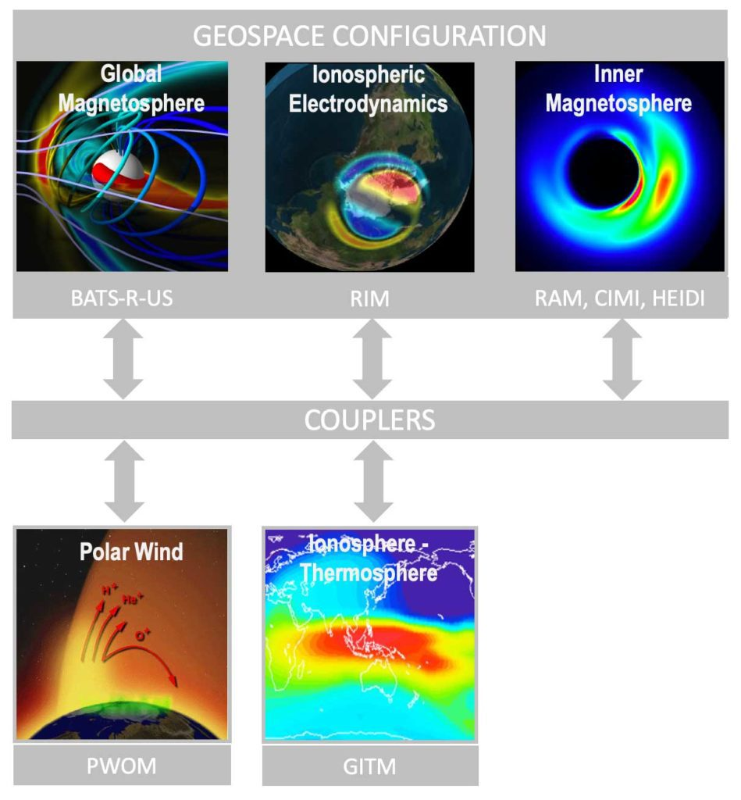

Numerical Simulation of Plasma Bubbles
======

The Equatorial Plasma Bubbles (EPBs) are low-density plasma structures embedded in the large-scale Equatorial Ionization Anomaly (EIA). During storm time, EPBs can even reach mid-latitudes, e.g., the equatorward boundary of the main trough. These EPBs are termed super bubbles. We developed the coupled GITM (Global Ionosphere Thermosphere Model) and SAMI3 to simulate the response of the thermosphere-ionosphere-plasmasphere system to geomagnetic storms. Taking advantage of this coupled model, we can investigate the generation mechanism of the super bubbles.

Forecast of Global TEC Maps
======

The ionospheric TEC can be calculated using different delays of two or more transmitted frequencies from the Global Navigation Satellite Systems (GNSS), including GPS. In the GNSS era, the ionospheric TEC provides us with an unprecedented opportunity to image the ionosphere plasma content between ground-based receivers and the GNSS satellites.

Our TEC map reconstruction model, Video Imputation with SoftImpute, Temporal smoothing and Auxiliary data (VISTA), is capable of imputing a time series of matrices with a large number of missing values and guarantees both spatial smoothness and temporal consistency, which is very helpful for reconstructing scientific images with non-random missingness, i.e., the TEC maps/videos. Using this algorithm, we built a public TEC map database (https://doi.org/10.7302/jab6-2911). 

Furthermore, we developed advanced ML models to predict global Total Electron Content (TEC) maps. We aim to develop models that could reveal multiscale structures and include important space weather events, such as geomagnetic storms and solar flares.

Hemispheric Asymmetry in the Thermosphere
======

Since the launch of GOLD, spatial and temporal evolution of the thermospheric composition and temperature can be investigated in detail. Using GOLD observations, we investigate the hemispheric asymmetry in the thermospheric composition and temperature. We are interested in its latitude, LT, and seasonal dependence. We also use GITM to investigate its generation mechanisms, such as tides, and Poynting Flux. 

Improve Electrodynamics and dynamics in the polar region
======

We improve the specification of the conductance in the polar region using new datasets (e.g., PFISR) and/or new techniques (ML). Furthermore, we investigate their dynamic impact in the polar region. 

